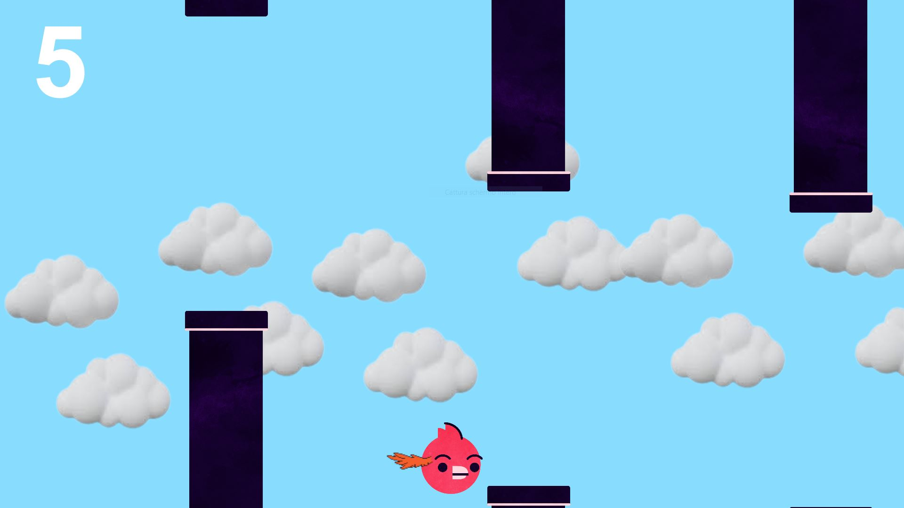
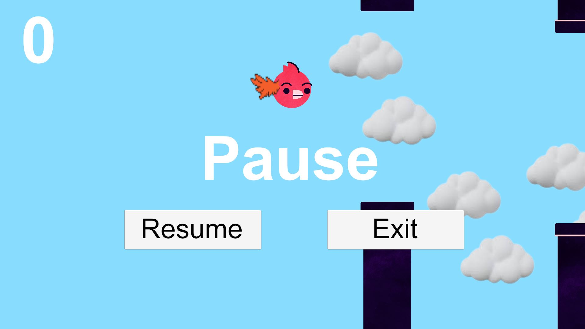
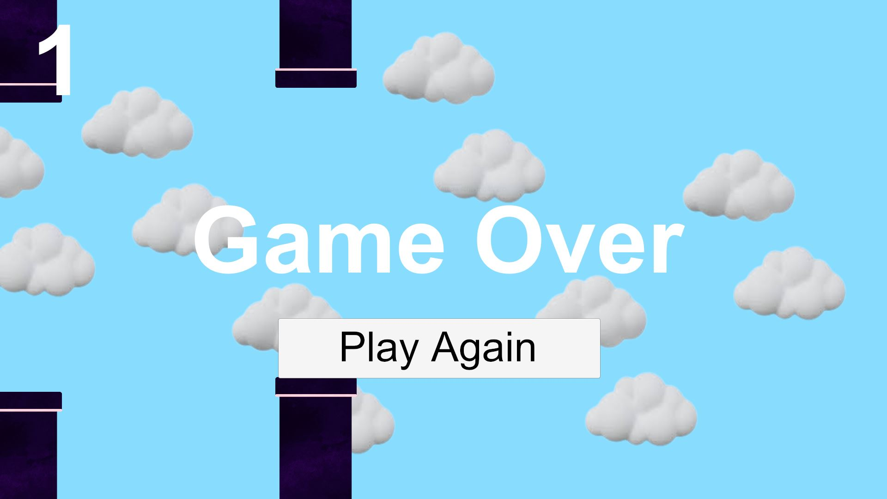

# My Flappy Bird
Personal project for the realization of a PC game.

# Project Specifications
The project's aim is learning the fundamentals of game development.
For the realization of the project it has been used the Unity game engine together with the C# programming language.

# Game Specifications
The gameplay has been designed to be similar to the one of the original Flappy Bird game.
The aim of the game is to make the bird fly through a pair of pipes, without hitting them.

# Screenshot

